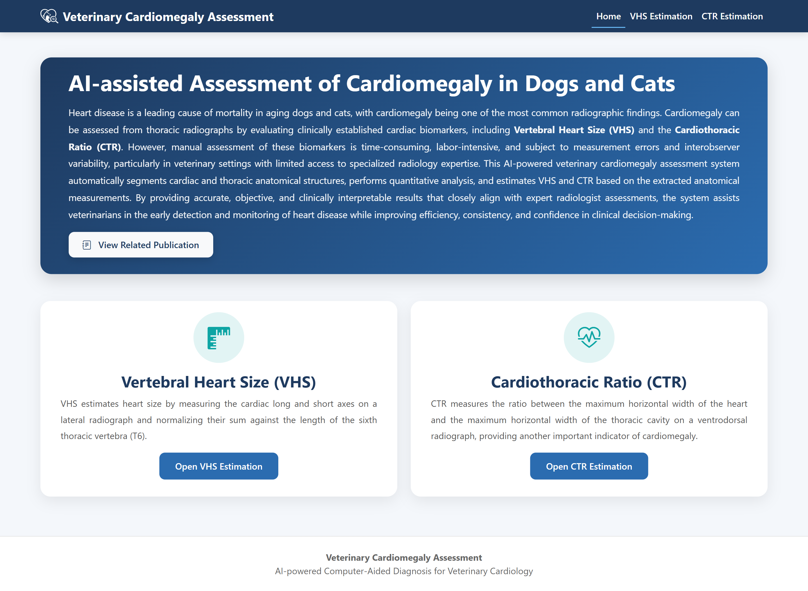
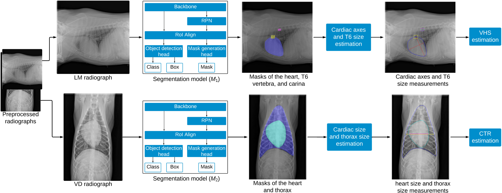
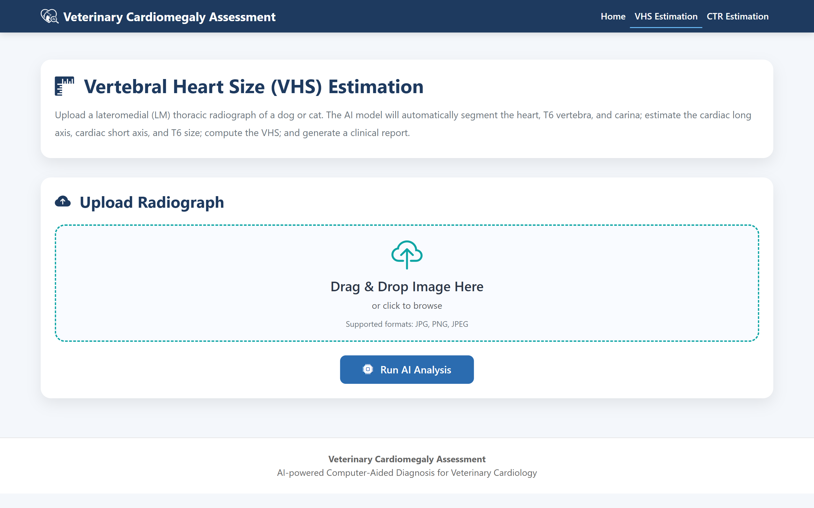
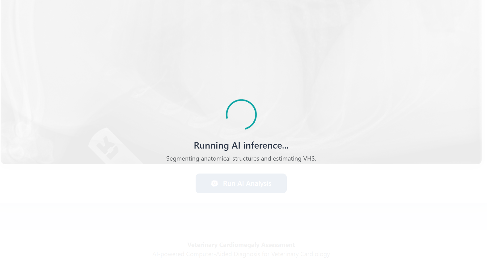
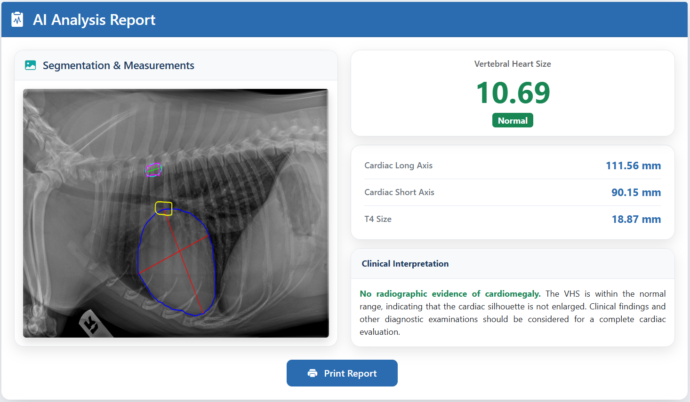
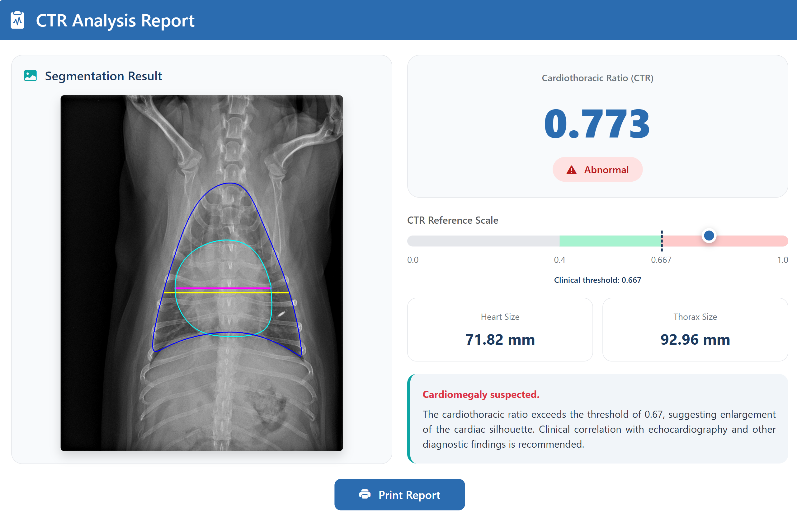

# AI-based Cardiomegaly Assessment for Dogs and Cats

<p align="center">
  
</p>

<p align="center">

[]()
[]()
[]()
[]()
[]()
[](https://doi.org/10.3389/fvets.2025.1612338)

</p>

---

## Overview

This repository contains the official implementation accompanying the published paper:

> **Deep learning framework for vertebral heart size and cardiothoracic ratio estimation in dogs and cats using thoracic radiographs**

The software provides an AI-assisted web application for the automatic assessment of **cardiomegaly** in dogs and cats from thoracic radiographs. Using deep learning-based anatomical segmentation, the application automatically estimates two clinically important cardiac biomarkers:

- **Vertebral Heart Size (VHS, Buchanan Index)**
- **Cardiothoracic Ratio (CTR)**

The framework integrates image segmentation, anatomical landmark detection, quantitative measurement, and visual interpretation into a simple web interface designed to assist veterinary clinicians.

---

# Publication

**Mekonnen HT, Puig N, Elson A, López E, Martínez P, Campos S, Hernández F, Mayor D, Quilis J, Cufí X, Freixenet J, Oliver A, Lladó X and Martí R (2025).**

**Deep learning framework for vertebral heart size and cardiothoracic ratio estimation in dogs and cats using thoracic radiographs.**

*Frontiers in Veterinary Science.*

Volume 12, 2025.

DOI:

https://doi.org/10.3389/fvets.2025.1612338

---

# Workflow

<p align="center">

</p>

The proposed framework automatically performs:

1. Thoracic radiograph upload
2. Deep learning segmentation using Mask R-CNN
3. Anatomical landmark localization
4. Automatic cardiac biomarker estimation
5. Diagnostic interpretation
6. Visualization of measurements

---

# Features

✅ Automatic segmentation of

- Heart
- Thorax
- Sixth thoracic vertebra (T6)
- Carina

✅ Automatic estimation of

- Vertebral Heart Size (VHS / Buchanan Index)
- Cardiothoracic Ratio (CTR)

✅ Automatic visualization

- Segmentation masks
- Anatomical landmarks
- Measurement axes
- Clinical report

✅ Interactive web interface

- Drag-and-drop image upload
- Image preview
- AI inference
- Printable reports
- PDF export

✅ Research-oriented software architecture

- Flask
- Detectron2
- PyTorch
- Docker
- Modular design

---

# Web Application

## Home Page

<p align="center">

</p>

---

## Vertebral Heart Size Estimation

<p align="center">

</p>

---

## Analyzing Radiograph

<p align="center">

</p>

---

## Example Result

### VHS Estimation

<p align="center">

</p>

### CTR Estimation

<p align="center">

</p>

---

# Project Structure

```text
.
├── app.py
├── config.py
├── predictor.py
├── services/
│   ├── bi_service.py
│   └── ctr_service.py
├── utils/
├── templates/
├── static/
├── models/
├── Dockerfile
├── docker-compose.yml
├── requirements.txt
├── LICENSE
├── CITATION.cff
└── README.md
```

---

## Technology Stack

- **Programming Language:** Python
- **Web Framework:** Flask
- **Deep Learning Frameworks:** PyTorch, Torchvision, Detectron2
- **Computer Vision Libraries:** OpenCV, Pillow
- **Scientific Computing:** NumPy, SciPy, Pandas
- **Configuration Management:** PyYAML
- **Deployment:** Docker, Gunicorn

---

# Installation

Clone the repository

```bash
git clone https://github.com/Habtamu-Tilahun/veterinary-cardiomegaly-assessment.git

cd veterinary-cardiomegaly-assessment
```

Create a virtual environment

```bash
python -m venv .venv
```

Activate it

Linux/macOS

```bash
source .venv/bin/activate
```

Windows

```bash
.venv\Scripts\activate
```

Install dependencies

```bash
pip install -r requirements.txt
```

Install Detectron2

```bash
pip install --no-build-isolation "git+https://github.com/facebookresearch/detectron2.git@v0.6"
```

---

## Model Weights

The trained **Detectron2 Mask R-CNN** model weights are not included in this repository due to their size. They can be downloaded from the Hugging Face Model Hub:

**https://huggingface.co/Habtamu-Tilahun/veterinary-cardiomegaly-assessment-models**

Download the following files and place them in the `models/weights/` directory:

```text
models/
└── weights/
    ├── model_4050_512_2_5e-3.pth   # VHS estimation model
    └── model_5600_256_2_5e-3.pth   # CTR estimation model
```

The application expects these model weights in the `models/weights/` directory. If you store them elsewhere, update the model paths in the application accordingly.

---

# Running the Application

Run locally

```bash
python app.py
```

Open

```
http://localhost:5000
```

---

# Docker

Build

```bash
docker compose build
```

Run

```bash
docker compose up
```

Then open

```
http://localhost:5000
```

---

# Example Workflow

1. Open the web application.

2. Select either

- Vertebral Heart Size estimation

or

- Cardiothoracic Ratio estimation.

3. Upload a thoracic radiograph.

4. The trained Mask R-CNN model automatically segments the anatomical structures.

5. The application computes the requested cardiac biomarker.

6. The predicted measurements and annotated image are displayed together with a clinical interpretation.

---

# Citation

If you use this software in your research, please cite:

```bibtex
@article{Mekonnen2025,
  title={Deep learning framework for vertebral heart size and cardiothoracic ratio estimation in dogs and cats using thoracic radiographs},
  author={Mekonnen, Habtamu Tilahun and Puig, Núria and Elson, Alejandro and López, Elena and Martínez, Paula and Campos, Selene and Hernández, Francisco and Mayor, Daniel and Quilis, Jorge and Cufí, Xavier and Freixenet, Jordi and Oliver, Arnau and Lladó, Xavier and Martí, Robert},
  journal={Frontiers in Veterinary Science},
  volume={12},
  year={2025},
  doi={10.3389/fvets.2025.1612338}
}
```

The repository also includes a `CITATION.cff` file for automatic citation generation by GitHub.

---

# License

This repository is released for **research and educational purposes**.

Please cite the accompanying publication when using this software in academic work.

---

# Acknowledgements

This project was developed through a collaborative effort between the **Computer Vision and Robotics Research Institute (ViCOROB)** at the **University of Girona (UdG)**, **Substrate AI**, **4D Médica**, **Hospital Veterinario Bluecare**, and **Integral Clínica Veterinaria Cullera**.

We sincerely thank the veterinary teams at **Hospital Veterinario Bluecare** and **Integral Clínica Veterinaria Cullera** for providing the thoracic radiographs, expert clinical annotations, and independent evaluations that were essential for the development and validation of this work.

We also gratefully acknowledge **Substrate AI** for its project management and coordination, and **4D Médica** for its collaboration and technical support throughout the project. We thank the **University of Girona** for providing the research environment and scientific guidance that made this work possible.

This work was partially supported through a research collaboration agreement between **Substrate AI** and the **University of Girona**.

---

# Author

**Habtamu Mekonnen**

Medical Image Analysis • Computer Vision • Deep Learning

GitHub: https://github.com/Habtamu-Tilahun

Google Scholar: https://scholar.google.com/citations?user=0Mrsbl0AAAAJ&hl=en

LinkedIn: https://www.linkedin.com/in/habtamu-tilahun-mekonnen/